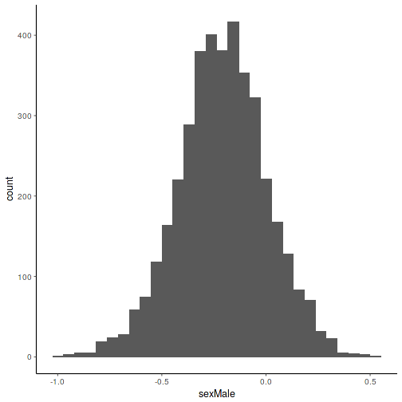

# Introduction

**Target group** of this tutorial: people who are willing to learn about and experiment with Bayesian inference in a relatively light-weight manner.

**Learning goals** This tutorial gets you started in probabilistic programming. The aim is to learn how basic linear models can be implemented and extended using probabilistic programming tools, and understanding the underlying motivations and challenges.

**Structure of the tutorial** This material provides starting points for experimenting with the tools and provides links to further online resources. The material is intended to be used in combination with lectures and hands-on instruction. 

## Probabilistic versus classical (frequentist) models

Probabilistic programming provides alternatives to classical models. Often, the models are identical under particular modeling assumptions. The probabilistic framework provides expanded opportunities to modify the model structure, distributional assumptions, and prior information.

This is particularly useful in cases where analytical solutions are not available, and classical counterparts may not exist. When both alternatives are available, incorporation of prior information can help to avoid overfitting and deal with small sample sizes, adding robustness in probabilistic models.

In standard cases, the Bayesian and frequentist versions give mostly similar estimates for the model parameters. This is not always the case, however. An example is given in the [stan_lm](http://mc-stan.org/rstanarm/articles/lm.html) page. In that example, the use of Bayesian prior helps to avoid overfitting and finds a more accurate solution when the sample size is small compared to the model complexity.

Due to time limitations, comparisons to the classical/frequentist models are not considered in this workshop. Instead, we focus on the use and interpretation of the probabilistic version.


# The tools: rstanarm

The [rstanarm R package](http://mc-stan.org/rstanarm/) is based on the Stan probabilistic programming language, but uses syntax that is familiar to R users who are familiar with traditional linear models.

For a more comprehensive introduction, check the [rstanarm tutorial](http://mc-stan.org/rstanarm/articles/aov.html).

Let us load the necessary libraries in R:


# Example data

Let us load example data. This data set from [Lahti et al. Nat. Comm. 5:4344, 2014](http://www.nature.com/ncomms/2014/140708/ncomms5344/full/ncomms5344.html) has microbiota profiles for 130 genus-like taxa across 1006 normal western adults from [Data Dryad](http://doi.org/10.5061/dryad.pk75d). Load the data in R:


```r
# Load example data
library(microbiome)
data(dietswap)

# Some necessary data preparations
sample_data(dietswap)$time <- sample_data(dietswap)$timepoint
x <- baseline(dietswap)
df <- meta(x)
df$diversity <- diversities(x, "shannon")$shannon
```


# Analysis steps

## Constructing the model

Let us fit [probabilistic ANOVA model](http://mc-stan.org/rstanarm/articles/aov.html).


```r
post <- stan_aov(diversity ~ sex + nationality + bmi_group, data = df,
                 prior = R2(location = 0.5))
```

```
## 
## SAMPLING FOR MODEL 'lm' NOW (CHAIN 1).
## 
## Gradient evaluation took 1.5e-05 seconds
## 1000 transitions using 10 leapfrog steps per transition would take 0.15 seconds.
## Adjust your expectations accordingly!
## 
## 
## Iteration:    1 / 2000 [  0%]  (Warmup)
## Iteration:  200 / 2000 [ 10%]  (Warmup)
## Iteration:  400 / 2000 [ 20%]  (Warmup)
## Iteration:  600 / 2000 [ 30%]  (Warmup)
## Iteration:  800 / 2000 [ 40%]  (Warmup)
## Iteration: 1000 / 2000 [ 50%]  (Warmup)
## Iteration: 1001 / 2000 [ 50%]  (Sampling)
## Iteration: 1200 / 2000 [ 60%]  (Sampling)
## Iteration: 1400 / 2000 [ 70%]  (Sampling)
## Iteration: 1600 / 2000 [ 80%]  (Sampling)
## Iteration: 1800 / 2000 [ 90%]  (Sampling)
## Iteration: 2000 / 2000 [100%]  (Sampling)
## 
##  Elapsed Time: 0.223012 seconds (Warm-up)
##                0.155396 seconds (Sampling)
##                0.378408 seconds (Total)
## 
## 
## SAMPLING FOR MODEL 'lm' NOW (CHAIN 2).
## 
## Gradient evaluation took 8e-06 seconds
## 1000 transitions using 10 leapfrog steps per transition would take 0.08 seconds.
## Adjust your expectations accordingly!
## 
## 
## Iteration:    1 / 2000 [  0%]  (Warmup)
## Iteration:  200 / 2000 [ 10%]  (Warmup)
## Iteration:  400 / 2000 [ 20%]  (Warmup)
## Iteration:  600 / 2000 [ 30%]  (Warmup)
## Iteration:  800 / 2000 [ 40%]  (Warmup)
## Iteration: 1000 / 2000 [ 50%]  (Warmup)
## Iteration: 1001 / 2000 [ 50%]  (Sampling)
## Iteration: 1200 / 2000 [ 60%]  (Sampling)
## Iteration: 1400 / 2000 [ 70%]  (Sampling)
## Iteration: 1600 / 2000 [ 80%]  (Sampling)
## Iteration: 1800 / 2000 [ 90%]  (Sampling)
## Iteration: 2000 / 2000 [100%]  (Sampling)
## 
##  Elapsed Time: 0.195728 seconds (Warm-up)
##                0.172846 seconds (Sampling)
##                0.368574 seconds (Total)
## 
## 
## SAMPLING FOR MODEL 'lm' NOW (CHAIN 3).
## 
## Gradient evaluation took 8e-06 seconds
## 1000 transitions using 10 leapfrog steps per transition would take 0.08 seconds.
## Adjust your expectations accordingly!
## 
## 
## Iteration:    1 / 2000 [  0%]  (Warmup)
## Iteration:  200 / 2000 [ 10%]  (Warmup)
## Iteration:  400 / 2000 [ 20%]  (Warmup)
## Iteration:  600 / 2000 [ 30%]  (Warmup)
## Iteration:  800 / 2000 [ 40%]  (Warmup)
## Iteration: 1000 / 2000 [ 50%]  (Warmup)
## Iteration: 1001 / 2000 [ 50%]  (Sampling)
## Iteration: 1200 / 2000 [ 60%]  (Sampling)
## Iteration: 1400 / 2000 [ 70%]  (Sampling)
## Iteration: 1600 / 2000 [ 80%]  (Sampling)
## Iteration: 1800 / 2000 [ 90%]  (Sampling)
## Iteration: 2000 / 2000 [100%]  (Sampling)
## 
##  Elapsed Time: 0.180139 seconds (Warm-up)
##                0.164917 seconds (Sampling)
##                0.345056 seconds (Total)
## 
## 
## SAMPLING FOR MODEL 'lm' NOW (CHAIN 4).
## 
## Gradient evaluation took 7e-06 seconds
## 1000 transitions using 10 leapfrog steps per transition would take 0.07 seconds.
## Adjust your expectations accordingly!
## 
## 
## Iteration:    1 / 2000 [  0%]  (Warmup)
## Iteration:  200 / 2000 [ 10%]  (Warmup)
## Iteration:  400 / 2000 [ 20%]  (Warmup)
## Iteration:  600 / 2000 [ 30%]  (Warmup)
## Iteration:  800 / 2000 [ 40%]  (Warmup)
## Iteration: 1000 / 2000 [ 50%]  (Warmup)
## Iteration: 1001 / 2000 [ 50%]  (Sampling)
## Iteration: 1200 / 2000 [ 60%]  (Sampling)
## Iteration: 1400 / 2000 [ 70%]  (Sampling)
## Iteration: 1600 / 2000 [ 80%]  (Sampling)
## Iteration: 1800 / 2000 [ 90%]  (Sampling)
## Iteration: 2000 / 2000 [100%]  (Sampling)
## 
##  Elapsed Time: 0.190757 seconds (Warm-up)
##                0.202785 seconds (Sampling)
##                0.393542 seconds (Total)
```


Investigate the fitted model:


```
## stan_aov
##  family:       gaussian [identity]
##  formula:      diversity ~ sex + nationality + bmi_group
##  observations: 38
## ------
##                     Median MAD_SD
## (Intercept)          3.0    0.3  
## sexMale             -0.2    0.2  
## nationalityAFR      -0.6    0.2  
## bmi_groupoverweight -0.1    0.3  
## bmi_groupobese      -0.4    0.3  
## sigma                0.6    0.1  
## log-fit_ratio        0.0    0.1  
## R2                   0.3    0.1  
## 
## Sample avg. posterior predictive distribution of y:
##          Median MAD_SD
## mean_PPD 2.4    0.1   
## 
## ANOVA-like table:
##                     Median MAD_SD
## Mean Sq sex         0.1    0.2   
## Mean Sq nationality 3.0    1.8   
## Mean Sq bmi_group   0.6    0.5   
## 
## ------
## For info on the priors used see help('prior_summary.stanreg').
```


Investigate the posterior samples:


```
##   (Intercept)    sexMale nationalityAFR bmi_groupoverweight bmi_groupobese
## 1    3.237151 -0.2882968     -0.7264619          -0.3447235    -0.44081862
## 2    3.266103 -0.3191635     -0.7447252          -0.3180243    -0.50947996
## 3    2.461461  0.1311067     -0.5253654           0.3772697    -0.09554517
## 4    2.494157  0.1889572     -0.5280116           0.4606210    -0.02320149
## 5    3.666957 -0.5558136     -0.7362872          -0.5333490    -0.92029889
## 6    3.616087 -0.6719317     -0.7595259          -0.4747462    -0.93062458
##       sigma log-fit_ratio        R2
## 1 0.4933064   -0.08155225 0.3261753
## 2 0.5085921   -0.04417510 0.3353587
## 3 0.5772832    0.05112323 0.2922975
## 4 0.5682038    0.05607990 0.3211467
## 5 0.6172637    0.12994433 0.3088833
## 6 0.5784347    0.11280686 0.3719359
```


Investigate the posterior samples for a selected parameter:




### Bayesian priors

Find out more about Bayesian priors in linear models (including ANOVA):

 - [Priors in linear models](http://mc-stan.org/rstanarm/articles/lm.html)

 - [More on priors in rstanarm](http://mc-stan.org/rstanarm/articles/priors.html)


## Draw from posterior distribution


## Assess the model fit and criticize the model


### Interactive ShinyStan 

Explore the use of [shinystan R package](http://mc-stan.org/users/interfaces/shinystan). This provides tools to diagnose stan models visually and numerically, including model parameters and convergence diagnostics for MCMC simulations.


ShinyStan is widely applicable to MCMC outputs from Stan, JAGS, BUGS, MCMCPack, NIMBLE, emcee, SAS, and others.

### Further model diagnostics

* Posterior predictive checks
* Leave-one-out cross-validation


# Assess changes in the model


# Tasks: extend and vary the linear model

For standard group-wise comparisons and random effects, see the tutorial on [ANOVA and mixed linear models](http://mc-stan.org/rstanarm/articles/aov.html). Experiment with the different options using either the provided example data, or a data set of your own.


# Troubleshooting

Ask the instructors, or see the [rstanarm tutorial](http://mc-stan.org/rstanarm/articles/rstanarm.html) for tips on common problems that may arise when altering the model.

# Other examples

You can also change modeling assumptions, or construct more complex models. See the [rstanarm tutorials](http://mc-stan.org/rstanarm/articles/index.html) for more examples. You can try these out, and we aim to support in the process!


# Further Resources and  literature

[R users will now inevitably become Bayesians](https://thinkinator.com/2016/01/12/r-users-will-now-inevitably-become-bayesians/)

[Online manual for rstanarm](http://mc-stan.org/rstanarm/)

[Video tutorial on rstanarm](https://www.youtube.com/watch?v=z7zOzL9Rrzs)


# Contact and acknowledgement

Regarding the course content, you can contact [Leo Lahti](http://www.iki.fi/Leo.Lahti).

We are grateful for the developers of rstan, rstanarm, and shinystan. Regarding the external tutorials used in this assignment, contact the respective authors.


